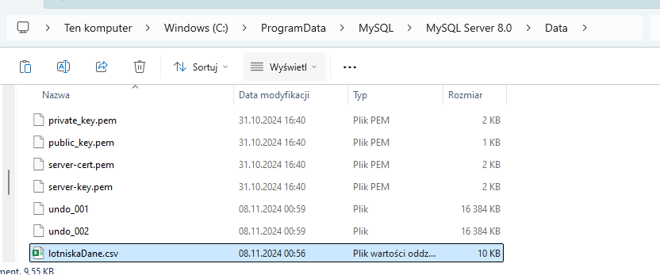
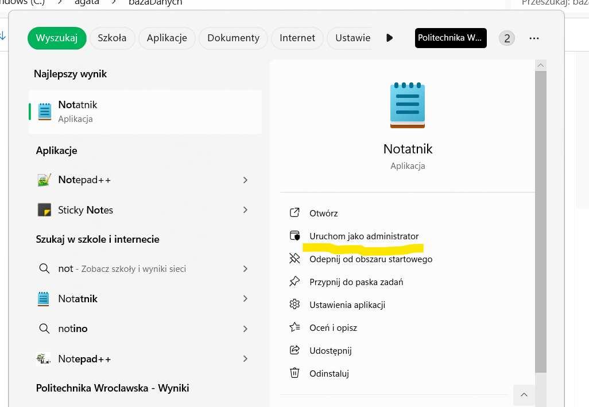
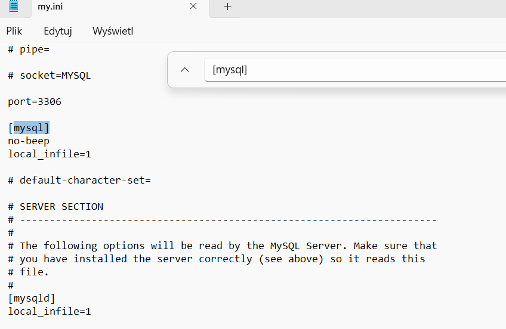

# Wczytanie lotnisk z pliku

1. Dodaj plik lotniskaDane.csv do poniżego folderu:



jego ścieżka:

"C:\ProgramData\MySQL\MySQL Server 8.0\Data\lotniskaDane.csv"

2. Zezwól na wczytywanie danych z pliku do tabel w mysql:

    a) otwórz notatnik z uprawnianiami admina

    

    b) otwórz w nim plik o podanej ścieżce na Windowsie:
    C:\ProgramData\MySQL\MySQL Server 8.0\my.ini

    lub na linux któryś z nich:
    /etc/mysql/my.cnf lub /etc/my.cnf

    c) wyszukaj [mysql] i [mysqld]

    
    
    dodaj w odpowiednie miejsca:
    local_infile=1
```
    [mysql]
    local_infile=1

    [mysqld]
    local_infile=1
```
    d) zresetuj mysql cmd
3. W mysql Command Line Client:

    a) 
    use database multitripfinder;

    b) jeśli jeszcze nie masz tabeli z lotniskami wykonaj:

    ```
   CREATE TABLE Airports (
    id INT PRIMARY KEY AUTO_INCREMENT,
    airport_code CHAR(3) NOT NULL,
    city_code CHAR(3) NOT NULL,
    airport_name VARCHAR(255) NOT NULL,
    city VARCHAR(255) NOT NULL,
    country VARCHAR(255) NOT NULL);
    ```

c) Wpisz lotniska z pliku CSV do tabeli:

```
    LOAD DATA LOCAL INFILE 'C:/ProgramData/MySQL/MySQL Server 8.0/Data/lotniskaDane.csv'
    INTO TABLE Airports
    FIELDS TERMINATED BY ','
    ENCLOSED BY '"'
    LINES TERMINATED BY '\r\n'
    (airport_code, city_code, airport_name, city, country);
```

UWAGA!!!:  '\r\n' jest bardzo ważne, bo na końcu kazdej linijki jest znak CR(Carriage Return)

d) przetestuj:

```
    SELECT * FROM Airports WHERE country = 'Poland';
```